# How It Fits Together

Diagrams for the parts that are hardest to hold in your head from prose. Each one points at the document that actually specifies the behavior — where a diagram and a spec disagree, the spec is right.

These are deliberately not one-to-one with the documents. A diagram earns its place by showing a *mechanism* that a list can't, so the flows with branches and the rules with asymmetries are here, and things that are already a clean list are not.

---

## 1. The shape of the system

Two paths that never cross. Writes go through a node and out to the network; reads never touch a node at all.

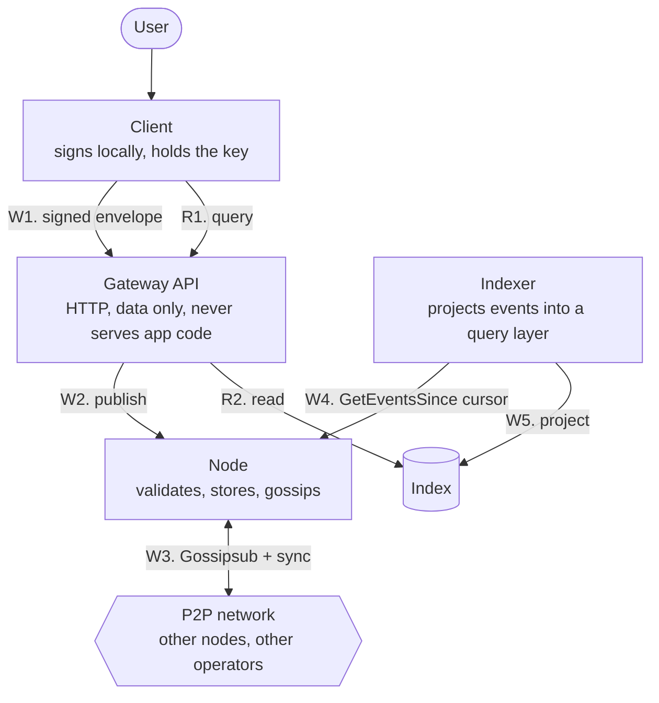

What to notice: the indexer **pulls** from the node rather than being pushed to, so it can be restarted, rebuilt, or run twice with different configuration. And the gateway serves data only — the client is a static bundle hosted independently, because whoever ships the code can ship code that steals the key. See [architecture.md](./architecture.md#substitutability-only-counts-if-the-client-isnt-served-by-the-gateway).

---

## 2. Publishing one review, end to end

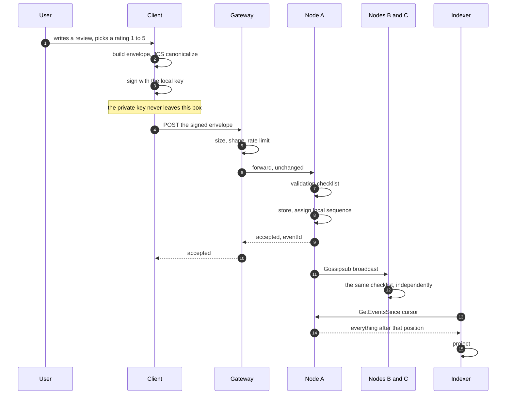

What to notice: the gateway never signs and never modifies. It checks shape and forwards bytes. Nodes B and C re-run the entire validation themselves — nothing is trusted for having arrived from a peer, including from the node that first accepted it.

---

## 3. What a node does when an event arrives

The numbered list in [protocol.md](./protocol.md#validation-checklist-every-node-runs-this-on-receipt) reads like a straight line. It isn't — the branches are where the design lives.

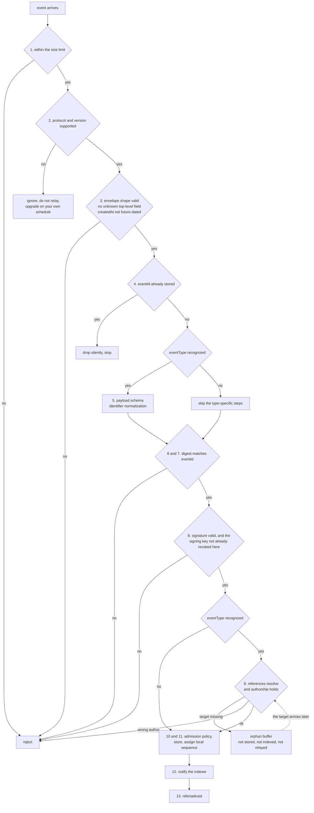

Three branches worth reading twice:

- **Unknown `eventType` keeps flowing.** It skips the type-specific steps and is still stored and relayed, so one un-upgraded node can't stall a new event type across the network.
- **A missing reference is not a rejection.** It's a delay. Rejecting would mean no rebroadcast, which would drop valid events out of the network for the crime of arriving a few hundred milliseconds early.
- **Duplicate detection sits before the expensive work**, so replaying an event a node already has costs a hash lookup rather than a signature verification.

---

## 4. Out-of-order arrival

Gossip doesn't deliver causally. A vote arriving before the review it targets is routine, not an attack.

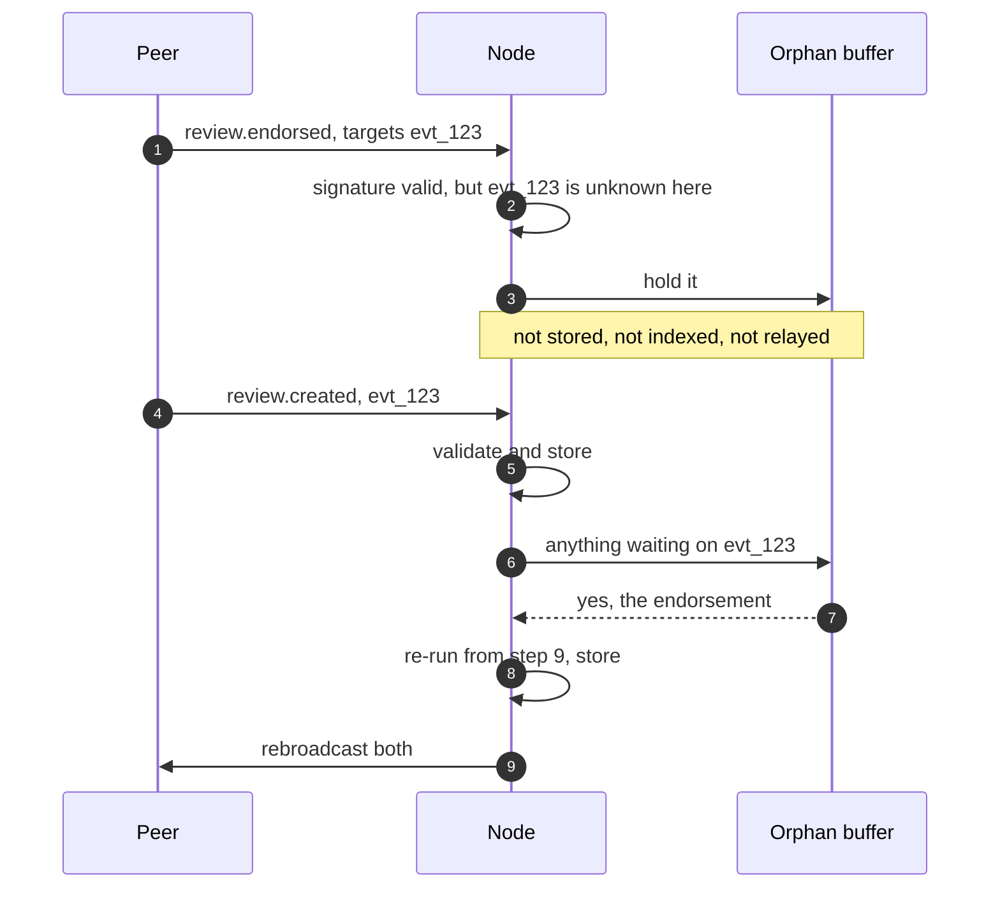

The buffer is bounded in size and age, and bounded **per peer** — otherwise flooding it with references that will never resolve would be a cheap way to evict everyone else's legitimate orphans. Eviction is safe: a genuine orphan comes back through ordinary sync, because whoever has the target has the child too.

---

## 5. Catching up after downtime

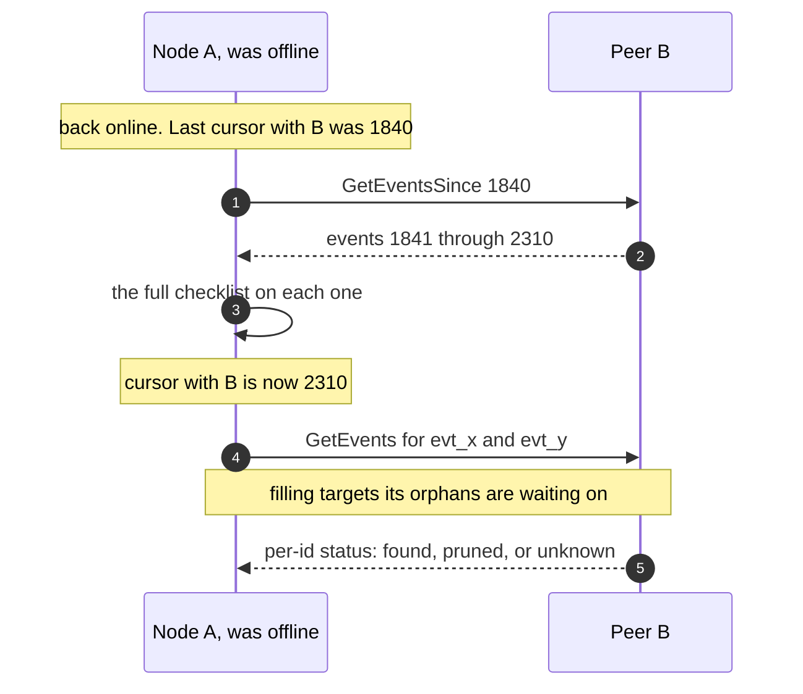

Two calls, and deliberately no more. The cursor is a position in **B's local receive sequence**, never a timestamp — an event stamped three years ago and published today would fall behind a timestamp cursor and never reach anyone syncing incrementally. That also means cursors aren't portable: A tracks one per peer, and starts from zero with a peer it has never met. See [protocol.md](./protocol.md#node-to-node-sync).

---

## 6. A review over time — and what attaches to what

The subtlest rule in the project, and the one most worth getting right in an implementation.

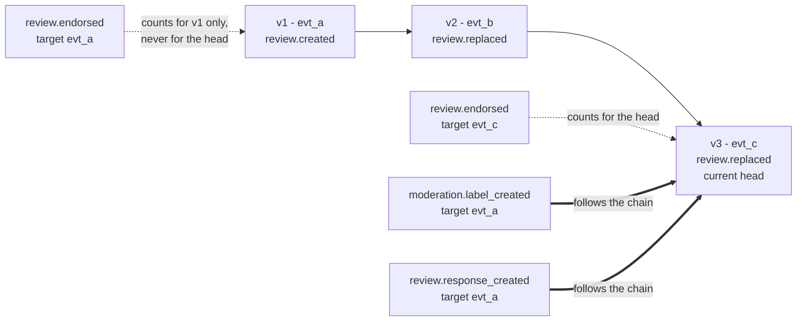

**Credit binds to the version that earned it; warnings and conversation bind to the thing.**

Votes stop at the version they were cast on, so an author can't collect endorsements and then swap the text underneath them. Labels and responses carry forward, so a spam label can't be cleared by publishing a one-character edit. Anything an author could *gain* by editing must not survive the edit; anything they could *escape* by editing must. See [protocol.md](./protocol.md#votes-do-not-follow-an-edit).

`replaces` names the immediately preceding version, not the original. Two edits naming the same predecessor is a fork, resolved by higher `createdAt` with ties on lower `eventId` — every link is by the same author, so that ordering is self-scoped and every implementation resolves the same head.

---

## 7. Identity: one key, or a cold root with hot devices

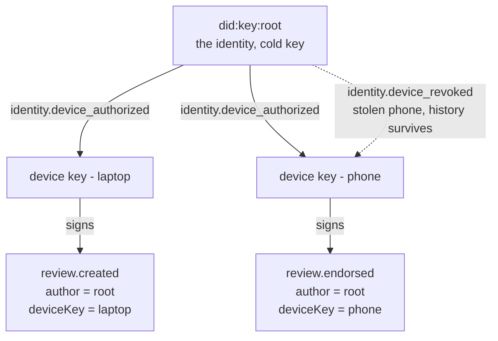

`author` is always the identity; `deviceKey` names whichever key produced the signature, and is `null` for a single-key identity. Every "same author" comparison in the protocol is against `author`, so swapping devices never fragments a history.

The `deviceKey` field ships in v1 even though v1 may never set it. The envelope is a closed set, so adding a field later is a breaking version bump the whole network must adopt in lockstep — a `null` per event now buys the option without a migration.

### Rotation: the first one observed is the one that holds

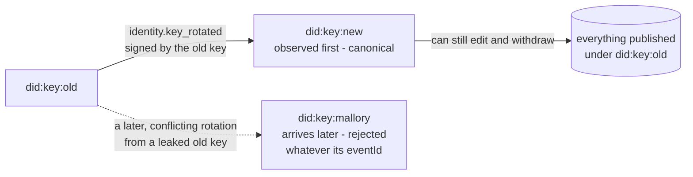

An identity has at most one successor, ever, and a node that has already accepted a rotation **rejects any later conflicting one outright** — no `eventId` comparison, no reconsideration.

An earlier version of this resolved conflicts by taking the lower `eventId` globally, which turned out to be a retroactive identity hijack: someone recovering a leaked old key months later could grind an `eventId` below the accepted rotation's, in about two attempts on average, and take the identity along with everything published since. A rule with no clock in it also had no history in it.

A node back-filling history sees both rotations at once and has no "first observed". It then **fails closed** — the identity is contested, neither successor is canonical, and history under the original key stays readable. A stolen key can therefore still freeze an identity, but never transfer it. See [identity.md](./identity.md#key-rotation).

---

## 8. From a claim to actual authority

Publishing a claim grants nothing. **Recognition** is where authority lives, and recognition is the consumer's decision.

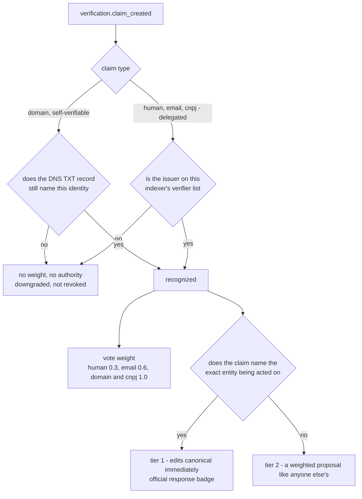

A `domain` claim never verifies once and stays true: it's **live state**, re-checked on a TTL, and a lapsed DNS record downgrades it without any revocation event existing. A claim also grants authority over the identifier it names and nothing else — a `domain` claim doesn't reach a `cnpj:` entity, because nothing in a DNS record says which CNPJ is behind it.

---

## 9. Who wins an entity metadata edit

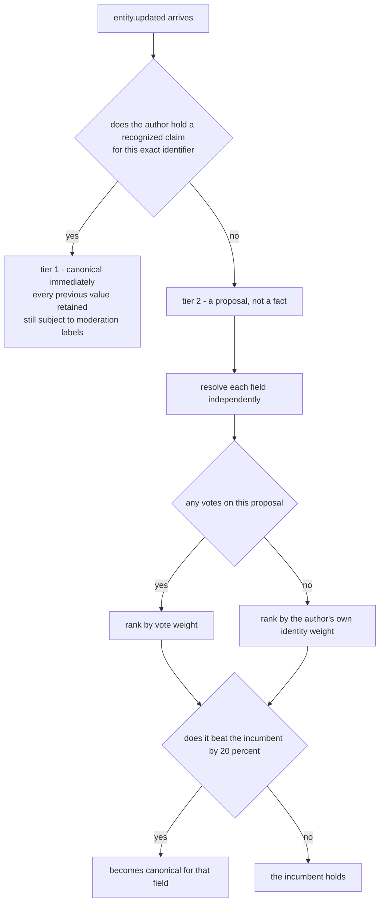

The fallback to author weight is the load-bearing part: nobody votes on a company's category, so ranking purely by votes means ranking zero against zero, and whatever tiebreak the implementation accidentally has becomes the real rule — almost always last-write-wins, which hands every entity to whoever edited most recently.

Note the consequence, spelled out in [entities.md](./entities.md#2-unverified-edit--a-proposal-not-a-fact): the *rule* is deterministic but the *outcome* is not, because weight is a local observation. Two honest indexers can land on different canonical values.

---

## 10. What is replayed, and what is re-derived

The project's central claim is that the index is a projection rebuildable from the log. That's true of one half of the index and not the other, and being precise about which is the difference between a testable property and a slogan.

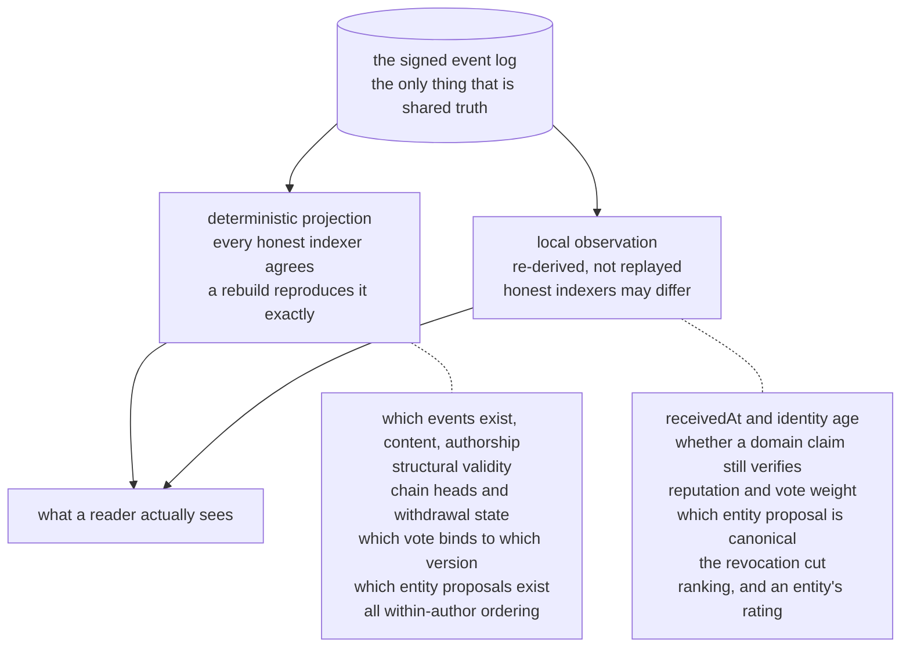

The test for which side something belongs on isn't "is the rule shared" — the rules are written down and identical either way. It's **"can it be recomputed from the events and nothing else."**

A disagreement between two indexers on the left is a bug in one of them. A disagreement on the right is the design working. Moving anything from right to left would require electing an authority over clocks, DNS, or ranking, which is precisely what this architecture exists to avoid. See [architecture.md](./architecture.md#what-must-be-identical-across-indexers-and-what-must-not-be).
