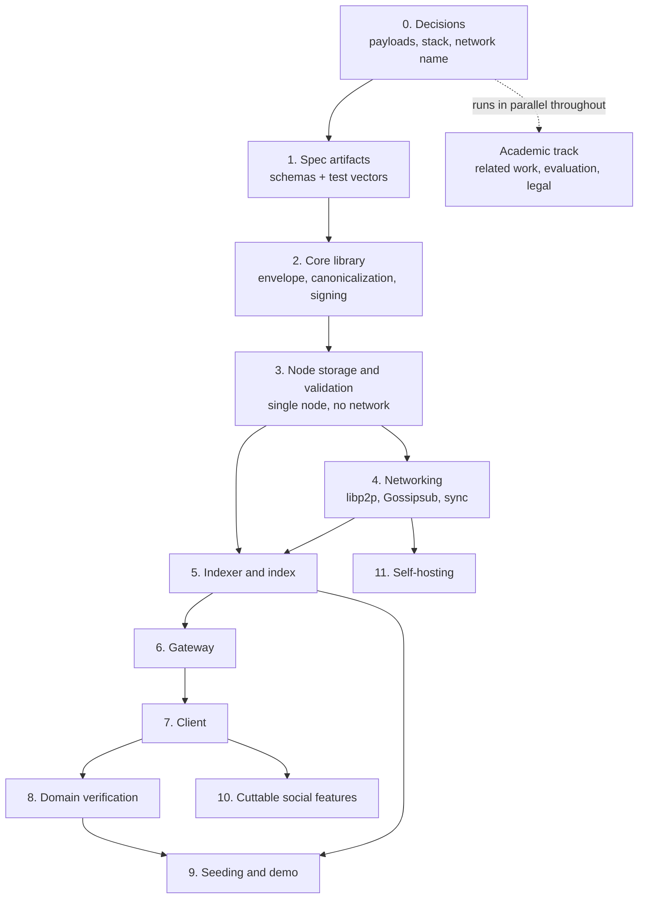

# Roadmap

The order to build things in, and why that order. [mvp.md](./mvp.md) says *what* v1 contains and *when it's done*; this says *what to do next*.

Two principles run through the ordering:

- **Push the risky thing later, but not last.** libp2p is the single largest schedule risk. Everything that can be correct without a network is built and tested first, so when networking starts, a bug there is unambiguously a networking bug — and if libp2p has to be swapped for the declared fallback, nothing built before it is wasted.
- **Instrument while building, not after.** The evaluation metrics are decided in step 0 so counters go in as each piece is written. Retrofitting measurement onto finished code is how a results chapter turns into guesswork.

## Dependencies

Note that **step 5 needs step 3 but not step 4**: an indexer can be built and tested against a single node's log while networking is still in progress. If libp2p stalls, the indexer, gateway and client are not blocked.

---

## 0. Decisions that block everything

Nothing here is code, and none of it can be deferred past the first line of it.

| Decision | Why it can't wait |
|---|---|
| ~~Payload schema per event type~~ | **Settled** ([protocol.md](./protocol.md#payloads)) — no longer a blocker. The remaining decisions below are all about implementation, not design. |
| **Language for the node** | `go-libp2p` is the most mature implementation, `rust-libp2p` is solid, `js-libp2p` is the weakest of the three exactly where this project leans hardest — long-lived connections and sync. This choice interacts directly with the largest risk on the board. |
| **Language for gateway, indexer, client** | Independent of the node — they speak HTTP and SQL, not libp2p. Can be whatever you're fastest in. |
| **Development network name** | `ecoa-dev`, or whatever you pick. It goes inside the signed bytes ([protocol.md](./protocol.md#network-separation)), so choosing it after events exist means re-signing all of them. |
| **Which metrics to collect** | See [the academic track](#academic-track-runs-in-parallel). Deciding now means counters get written alongside the code that needs them. |

**Done when:** all four are written down somewhere you'll look again. With payloads settled, none of these is a design question any more — they're choices about how to build, and the protocol no longer waits on any of them.

---

## 1. Spec artifacts

The interop contract. Everything downstream is tested against these, and for an academic project they're a citable artifact in their own right.

1. **JSON Schema per event type** — a mechanical transcription of [the payload spec](./protocol.md#payloads), including the enums and the per-field length limits.
2. **Canonicalization and signing test vectors** — input object, expected JCS bytes, expected `signing_input`, expected `eventId`, expected signature. This is what makes two independent implementations provably compatible.
3. **Strict-signature vectors** — the malleability cases specifically: non-canonical `S`, small-order keys, small-order `R`. Each must be *rejected*, and a permissive library will pass them, which is the whole point of having the vectors ([protocol.md](./protocol.md#signature-verification-must-be-strict)).
4. **Behavioral fixtures** for the rules that are easy to implement subtly differently: chain head resolution with a fork, conflicting rotations, orphan buffering and release, vote-to-version binding across an edit, per-field entity resolution.

**Done when:** a fixture file exists for each, with expected outputs, runnable before any implementation exists.

---

## 2. Core library

Not the node — the protocol, as a library with no network and no storage. Everything in this step is a pure function.

1. Envelope encode/decode, closed-set validation, required fields present.
2. JCS canonicalization, NFC normalization, duplicate-key rejection, nesting depth cap.
3. `eventId` and the domain-separated `signing_input`.
4. Strict Ed25519 signing and verification, `did:key` encode/decode.
5. Validation checklist steps 1–8 — everything that needs no stored state.

**Why separate from the node:** you can pass the entire vector set from step 1 with zero infrastructure. Every later bug is then not a canonicalization bug, which is the hardest kind to find once a network is in the picture.

**Done when:** every vector from step 1 passes, including all the rejection cases.

---

## 3. Node storage and the rest of validation

Still no network. A single process that accepts events and gets every rule right.

1. Event store, with a local receive timestamp and monotonic local sequence.
2. Validation steps 9–11: reference resolution, authorship checks, the orphan buffer with its bounds, admission policy.
3. Derived state the node itself needs: replace chains and head resolution, rotation and revocation state with first-observed semantics.
4. Tombstones — the shape only. No v1 node prunes ([protocol.md](./protocol.md#sync-against-a-peer-that-pruned-data)).

**Done when:** feeding the behavioral fixtures from step 1 through a single node produces the expected accept/reject/buffer outcome for each. Acceptance criteria covered: signature and schema rejection, oversize, unknown envelope field, future-dated `createdAt`, out-of-order references, conflicting rotations.

---

## 4. Networking

The risky step, and deliberately isolated so that its risk is contained.

1. libp2p host, identity, transport, connection manager limits.
2. Bootstrap and peer discovery, with the list overridable from configuration on day one.
3. Gossipsub on the single topic `/ecoa/events/1`.
4. Sync: `GetEventsSince(cursor)` and `GetEvents(ids)`, with per-peer rate limits.
5. Three nodes running locally.

**Done when:** an event published to one node reaches the other two; a node taken down and brought back catches up through sync; taking one node down doesn't stop propagation between the others.

**If this stalls:** the declared fallback is plain gossip over WebSocket with a static peer list ([mvp.md](./mvp.md#key-risks)). It replaces this step and only this step — steps 2 and 3 are untouched, because the protocol is meaning and libp2p is only transport.

---

## 5. Indexer and index

Can start as soon as step 3 is done; doesn't wait for networking.

1. Cursor consumer over the node's local sequence.
2. The deterministic projection: which events exist, chain heads, withdrawal state, vote-to-version binding, entity proposals ([architecture.md](./architecture.md#what-must-be-identical-across-indexers-and-what-must-not-be)).
3. Local observations, kept explicitly separate: identity age, claim weight, entity metadata resolution.
4. Full-text search.
5. Rebuild from log, as a first-class operation rather than a script someone wrote once.

**Done when:** dropping the index and rebuilding reproduces the deterministic half exactly, and two indexer instances fed the same log agree on all of it. This is also where the second-indexer demo comes from — same binary, two config files.

---

## 6. Gateway

Small, and worth keeping small.

1. Publish endpoint: validate shape, forward to the node, never sign, never modify.
2. Read endpoints returning **whole signed envelopes**, with derived fields alongside and clearly separated.
3. Rate limiting **without logging source addresses next to event content** ([identity.md](./identity.md#and-the-network-layer-knows-more-than-the-protocol-does)).
4. Configurable primary node with a fallback list.

**Done when:** a review published through the gateway lands on all three nodes, and reads return envelopes a client can verify independently.

---

## 7. Client

1. Key generation and storage, non-extractable where the platform allows.
2. Build, sign and publish an event locally.
3. Browse, search, entity page.
4. Client-side signature verification of everything received.
5. **Inspection view** — raw envelope beside the rendered review, live verification, which nodes hold it. Demo-critical.
6. Fresh-identity publishing as a visible option, with the trade stated at that moment.
7. Review replace and withdraw.
8. Review responses.

Items 7 and 8 sit here rather than in step 10 because the demonstration turns on them: editing after an endorsement, and a company response with an official badge.

**Done when:** identity creation with no signup, publishing without the gateway ever touching the key, and pointing the client at a different gateway by configuration alone.

---

## 8. Domain verification

After the client, because it needs a client to publish the claim and an indexer to check it.

1. DNS-over-HTTPS lookup in the indexer, DNSSEC preferred where the zone is signed.
2. Claim recognition, `expiresAt`, TTL re-check.
3. Tier-1 entity authority and the official-response badge.

**Done when:** publishing a TXT record and a self-signed claim produces a verified representative who can edit the entity and post a badged response — with no verifier service anywhere in the loop.

---

## 9. Seeding and the demonstration

1. Import entities from public Receita Federal data.
2. Synthetic review generator producing properly-signed events across them.
3. Second indexer instance with a different ranking configuration.
4. Rehearse the ten steps in [mvp.md](./mvp.md#the-demonstration).

**Why this is a step and not an afterthought:** a demonstration with four reviews reads as a toy regardless of what's underneath it, and the second indexer — the step that shows *why* the project is built this way — costs one config file and is the easiest thing to forget.

---

## 10. Cuttable social features

Profiles, reports, moderation labels and filters.

**This is the cut line.** If the schedule slips, these are described as designed-but-not-implemented and the central demonstration is unaffected. Everything before this point is not cuttable.

---

## 11. Self-hosting

Container image, node operator documentation, bootstrap list, metrics endpoint, status dashboard.

Mostly free if the node is a single binary, and it's what makes "a third party can run a node" a demonstrated claim rather than an asserted one.

---

## Academic track, runs in parallel

Not a phase. These are worth starting early and are actively harmed by being left to the end.

**Related work — do this first, before step 2.** The nearest neighbours are [Nostr](https://github.com/nostr-protocol/nips) (signed events, content-addressed ids, dumb relays, pluggable clients), [AT Protocol](https://atproto.com/) (signed repositories as truth, relay firehose, AppView as projection — architecturally very close to the log/index split here), [Secure Scuttlebutt](https://scuttlebutt.nz/) (append-only signed feeds, gossip replication), and ActivityPub (federated but server-authoritative, and the furthest away).

Writing this early is not administrative work: it forces the question of what this design actually contributes. The honest answer is that the transport layer is known art and the position between Nostr's simplicity and AT Protocol's weight is a deliberate choice — while the trust layer, weighted claims, entity edit authority, and vote-to-version binding, is where the contribution is. Nostr and AT Protocol both leave reputation to whoever builds on them.

**Evaluation metrics — decide in step 0, collect throughout.** Propagation latency across the three nodes, index rebuild time against event count, storage per event, validation throughput in signatures per second, orphan buffer occupancy under out-of-order delivery. All of them fall out of what's being built anyway, and the seeded dataset from step 9 gives them a realistic volume to run against.

**Legal policy** — LGPD, Marco Civil, and the illegal-content process ([mvp.md](./mvp.md#legal-exposure)). Independent of every implementation step, and the section most likely to be asked about in a defence.
